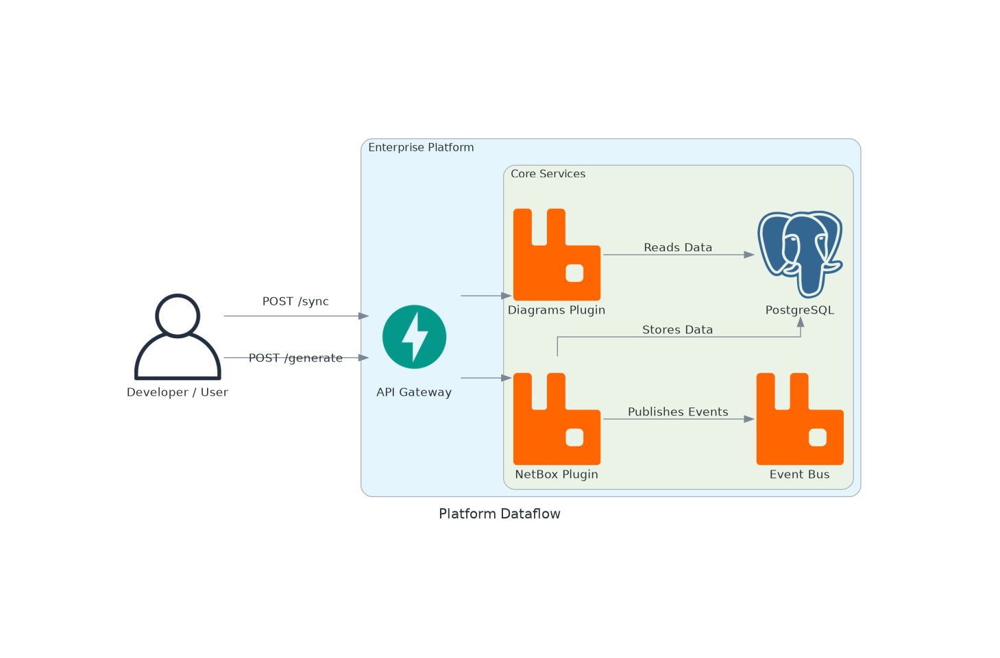

# Enterprise Network Infrastructure Platform



## Overview

This repository contains a multi-tenant, modular enterprise platform for network infrastructure management and visualization. It is designed to serve as the core for up to 15 distinct products, providing common services like authentication, data access, and asynchronous communication. The platform is built on a modern, asynchronous Python stack and is designed for scalability and extensibility.

## Features

*   **Modular Plugin Architecture:** The platform is built around a powerful plugin system that allows for the easy addition of new products and features. Each plugin is a self-contained module that can be discovered and loaded at runtime.
*   **Multi-Tenant by Design:** The entire platform is built with multi-tenancy at its core. Data is isolated at the database level, and all API endpoints are tenant-aware.
*   **Asynchronous from the Ground Up:** Built on FastAPI and an asynchronous stack, the platform is designed for high performance and scalability.
*   **Event-Driven Communication:** An integrated RabbitMQ event bus allows for asynchronous communication between plugins, enabling decoupled and resilient workflows.
*   **Multiple Data Stores:** The architecture is designed to leverage the best database for the job, with support for:
    *   **PostgreSQL:** For structured, relational data.
    *   **Neo4j:** For graph-based data and relationship analysis.
    *   **ClickHouse:** For high-performance, time-series data (coming soon).

### Implemented Plugins

*   **NetBox Plugin:**
    *   Integrates with a NetBox instance to synchronize key infrastructure data, including sites, devices, IP addresses, and prefixes.
    *   Provides read-only API endpoints for querying the synchronized data.
*   **Diagrams Plugin:**
    *   Generates network topology diagrams for specific sites based on the synchronized NetBox data.
    *   Provides an API endpoint to generate and return diagrams as PNG images.

## Architecture

The platform is composed of several key components:

*   **API Gateway:** A central FastAPI application that serves as the entry point for all API requests. It handles authentication, tenant isolation, and routing of requests to the appropriate plugins.
*   **Core Platform Services:** A set of common services that are available to all plugins, including database access, the event bus, and the plugin registry.
*   **Product Plugins:** Self-contained modules that provide specific features and functionality. Each plugin can have its own database models, API endpoints, and event listeners.
*   **Data Stores:** A collection of databases that are used to store different types of data.

## Getting Started

### Prerequisites

*   Python 3.10+
*   Docker and Docker Compose
*   `pre-commit` (for development)

### 1. Set Up the Environment

First, clone the repository:
```bash
git clone <repository-url>
cd <repository-name>
```

Next, create and activate a Python virtual environment:
```bash
python -m venv .venv
source .venv/bin/activate
```

### 2. Install Dependencies

The project uses `pip` and `setuptools` for dependency management. Install the project in editable mode with all development dependencies:

```bash
pip install -e .[dev]
```

### 3. Start Services

The required backend services (PostgreSQL, RabbitMQ, etc.) are managed via Docker Compose.

```bash
docker-compose up -d
```

### 4. Run Database Migrations

The project uses Alembic to manage database schema migrations. To apply all migrations, run:

```bash
alembic upgrade head
```

### 5. Run the Application

To start the FastAPI application, run:

```bash
uvicorn platform_core.api.main:app --reload
```
The API will be available at `http://127.0.0.1:8000`.

## Development

### Running Tests

The test suite is built with `pytest`. To run all tests, ensure your Docker services are running and then execute:

```bash
python -m pytest
```

### Code Quality

This project enforces strict code quality standards using `black`, `pylint`, `mypy`, and `isort`. These are managed via `pre-commit` hooks.

To set up the hooks, run:
```bash
pre-commit install
```

To run all checks manually:
```bash
pre-commit run --all-files
```
